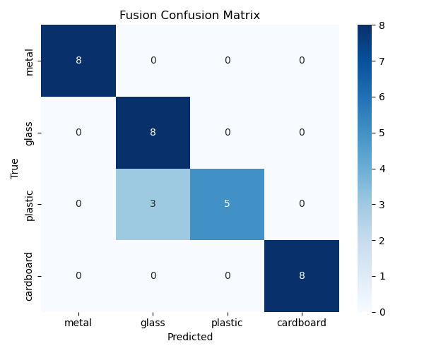
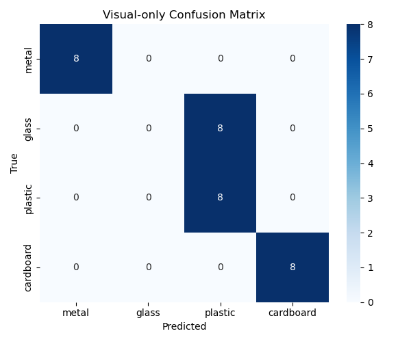

# Radar-Camera Fusion for Material Identification

[](LICENSE)

**SigLIP + lightweight CNN fusion for material classification using mmWave radar range-angle maps and RGB images.**

| Modality | Accuracy |
|----------|----------|
| Radar-only (SmallRACNN) | ✅ |
| Vision-only (SigLIP → MLP) | ✅ |
| **Radar + Vision Fusion** | ✅ **Best** |

---

## Overview

This project proposes a **multimodal fusion framework** for automatic material identification (metal, glass, plastic, cardboard) using:

- **Radar modality:** mmWave FMCW radar → Range-Angle (RA) map → lightweight 3-layer CNN (SmallRACNN) → 32-dim feature
- **Vision modality:** RGB image → SigLIP (prithivMLmods/Minc-Materials-23) → 768-dim embedding → MLP projection
- **Fusion:** Concatenate projected radar & visual features → FC classifier

### Key Design Decisions

| Component | Choice | Rationale |
|-----------|--------|-----------|
| Radar encoder | 3-layer CNN + GAP (SmallRACNN) | Small footprint, fast inference, works well on 2D RA maps |
| Visual encoder | SigLIP (pre-trained on MINC-23) | Zero-shot material knowledge, no need to train from scratch |
| Fusion strategy | Late fusion (feature-level concat) | Simple, interpretable, easy to ablate |
| Training | Frozen radar encoder, train proj + head | Avoid catastrophic forgetting of radar feature extractor |

---

## Results

### Fusion Model — Confusion Matrix



### Vision-only Model — Confusion Matrix



> **Note:** Detailed per-class metrics (precision, recall, F1) and ablation studies can be obtained by running `eval/test.py`.

---

## Dataset

> ⚠️ **The dataset used in this work was collected at the CUHK laboratory and is NOT publicly available.**

The dataset consists of synchronized mmWave radar ADC data and RGB images for four material classes (metal, glass, plastic, cardboard) under controlled conditions (25 cm / 50 cm distance, 0° / 30° angle). We provide the **data loading code** as a reference for preparing your own dataset, but the raw `.mat` / `.bin` / image files are **not included** in this repository.

To use this code with your own data, organize your dataset as:

```
data_root/
├── scene1/
│   ├── metal/
│   │   ├── adc_data_xxxx_xx_x_xx_x_ch01.mat
│   │   └── xxxxxx_rgb.png
│   ├── glass/
│   └── ...
├── scene2/
└── scene3/
```

Then set `root_dir` in the training/eval scripts accordingly.

---

## Requirements

- Python 3.8+
- [PyTorch](https://pytorch.org/) ≥ 2.0
- [HuggingFace Transformers](https://huggingface.co/) ≥ 4.30

Install dependencies:

```bash
pip install -r requirements.txt
```

---

## Usage

### 0. Pre-extract SigLIP Embeddings (one-time)

```bash
python utils/SigLipMINC23.py
```

This loads the pre-trained SigLIP model, processes all RGB images under `Scene1/`–`Scene3/`, and saves embeddings to `minc_rgb_embeddings.npz`.

### 1. Train Radar-only Model

```bash
python train/train.py
```

Trains SmallRACNN on RA maps and saves the best checkpoint as `small_ra_cnn_best.pth`.

### 2. Train Vision-only Model

```bash
python train/train_visual.py
```

Trains a lightweight MLP on SigLIP embeddings and saves the best checkpoint as `vision_only_best.pth`.

### 3. Train Fusion Model

```bash
python train_fusion.py
```

Fuses radar features (frozen) with visual features (projected) and trains the classification head. Best checkpoint saved as `fusion_best.pth`.

### 4. Evaluate All Modalities

```bash
python eval/test.py
```

Evaluates all three modalities on the held-out scene and prints confusion matrices + classification report.

### 5. Visualize Features

```bash
python analysis/tsne_radar.py
python analysis/tsne_visual.py
```

---

## MATLAB Radar Preprocessing

Raw `.bin` data from the TI IWR6843 mmWave radar is processed in MATLAB to generate Range-Angle (RA) maps. The pipeline is in the `matlab/` directory:

```
Raw .bin (IWR6843 DCA1000)
        │
        ▼
IWR6843_readDCA1000.m      ── Read binary → complex I/Q
        │
        ▼
ConvertBin2ChannelData.m   ── Organize into channel matrices
        │
        ▼
CalculateRAmap.m           ── 2D FFT → RA map (.mat)
```

**Quick start** — from raw `.bin` to RA map in one step:

```matlab
compute_RA_from_bin       % MATLAB: load bin → save RA map
```

See [`matlab/README.md`](matlab/README.md) for full details.

---

## Project Structure

```
CNN/
├── config/
│   └── config.py              # Task config (class map, scenes, num classes)
├── models/
│   ├── model.py               # SmallRACNN — radar encoder
│   ├── model_fusion.py        # RadarVisionFusionNet — fusion model
│   └── vision_head.py         # Vision-only classification heads
├── data/
│   ├── dataset.py             # RadarRADataset — RA map loading + augmentation
│   └── dataset_fusion.py      # RadarFusionDataset — adds SigLIP embeddings
├── train/
│   ├── train.py               # Radar-only training loop
│   └── train_visual.py        # Vision-only training loop
├── eval/
│   └── test.py                # Evaluation: confusion matrix + classification report
├── utils/
│   ├── SigLipMINC23.py        # SigLIP embedding extraction
│   └── SiglipTest.py          # SigLIP inference test
├── matlab/                      # Radar preprocessing (.bin → RA map)
│   ├── README.md
│   ├── compute_RA_from_bin.m
│   ├── IWR6843_readDCA1000.m
│   ├── ConvertBin2ChannelData.m
│   ├── CalculateRAmap.m
│   ├── CalculateRAmapNew.m
│   ├── Output.m
│   └── analysis/
│       ├── CalculateChanFeature.m
│       ├── CalculateChirpFeature.m
│       ├── CompareTimeDomain.m
│       └── EarlyLate.m
├── analysis/
│   ├── tsne_radar.py          # t-SNE visualization (radar features)
│   └── tsne_visual.py         # t-SNE visualization (visual features)
├── train_fusion.py            # Fusion training script (entry point)
├── FuseConf.png               # Final fusion confusion matrix
├── VisualConf.png             # Final vision-only confusion matrix
├── requirements.txt
├── LICENSE
└── README.md
```

---

## Citation

If you find this work useful for your research, please consider citing:

```bibtex
@misc{liang2025radarcamerafusion,
  author = {Liang, Jiajie},
  title = {Radar-Camera Fusion for Material Identification},
  year = {2025},
  publisher = {GitHub},
  url = {https://github.com/GargitMoe/Radar-Camera-fusion-model-for-material-identification}
}
```

---

## License

This project is licensed under the MIT License — see the [LICENSE](LICENSE) file for details.
